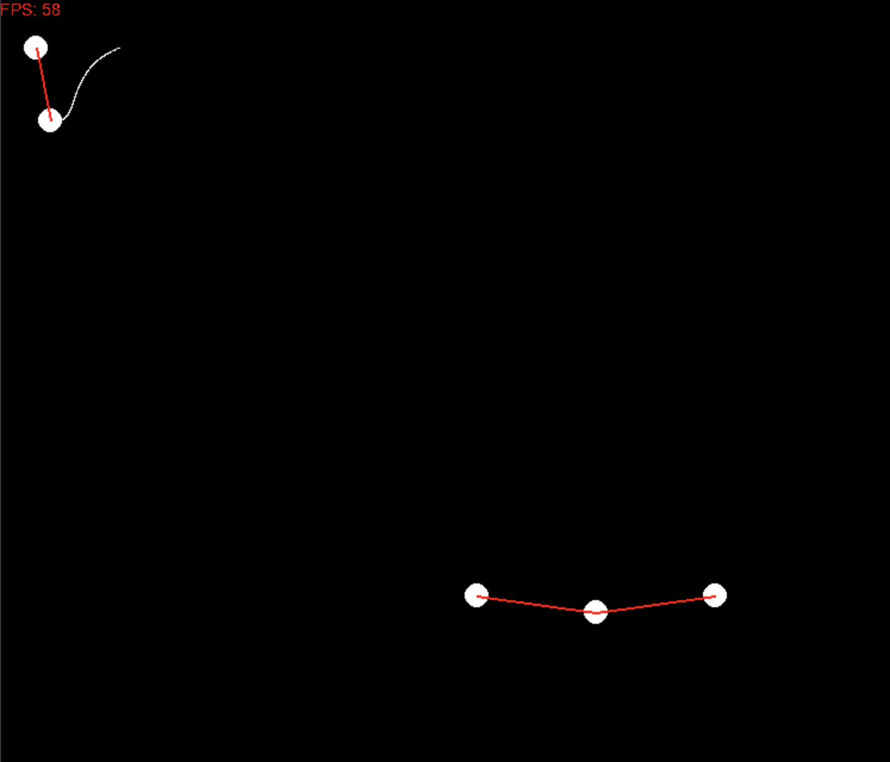
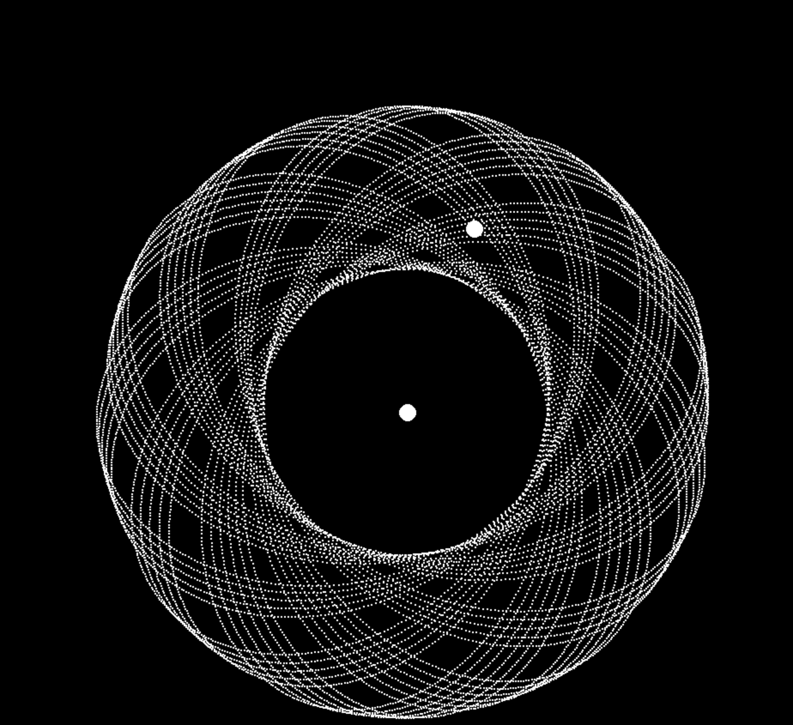

# Physics / Cloth sim
## TODO
* add dynamic zoom

* object collision
* drag on surfaces
* change to verlet integration
* add factory for cloth
* add interaction with springs

## Current State
### Springs

### Orbits

### Stable orbits
