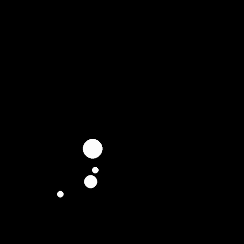

# Physics / Cloth sim
## TODO
### Cloth sim
* add springs using hooks law
* add gravity
* (remove gravity calculations between objects -> unecessary at this scale)

## Current state

## Stable orbits
