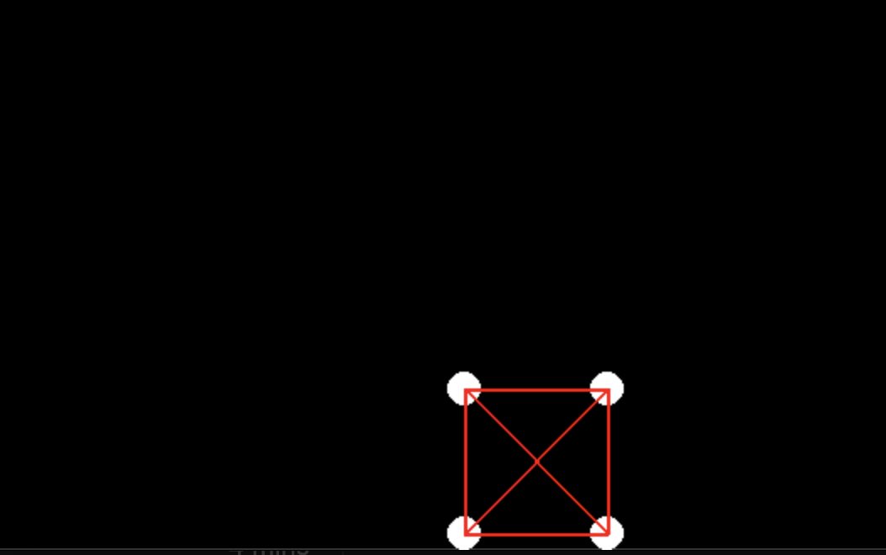

# Physics / Cloth sim
## TODO
* object collision
* friction on surfaces: 
Use [this](https://de.wikipedia.org/wiki/Reibungskoeffizient) for this purpose. Based on normal force and friction coefficient -> but to get normal force I have to either calculate it via f=ma or directly in "acceleration calculation" -> maybe change this to summing up the force on an object and do acceleration afterwards ?

* change to verlet integration
* add factory for cloth

## Current State
### Springs

### Orbits

### Stable orbits
